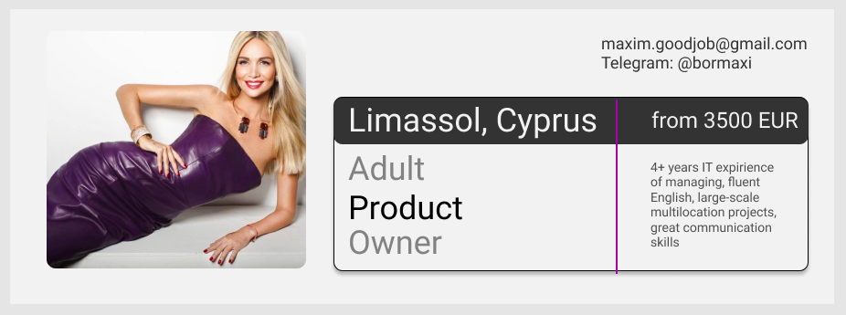
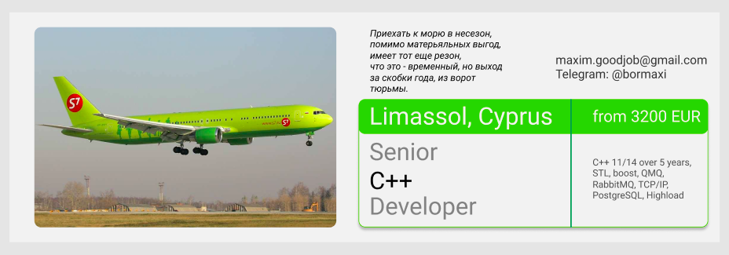
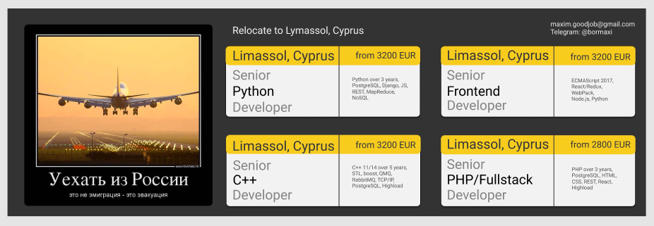

# figma-hiring-tickets

## Specific "hiring tickets" templates examples for job advertisements created on Figma (https://www.figma.com/) service prepared for layout and conversion to HTML or React/Angular code.

## In my opinion it is beautiful ))

> Ticket examples located in *images* folder.

> Layouts located in *exported-layouts* folder.

This layouts integrated with Anima Application (www.animaapp.com) through Anima + Sigma Integration (https://www.animaapp.com/figma) and may be converted to HTML or Angular/React code (for more information see Anima for Sigma prototypes documentation: https://docs.animaapp.com/v3/figma/prototype/index.html).